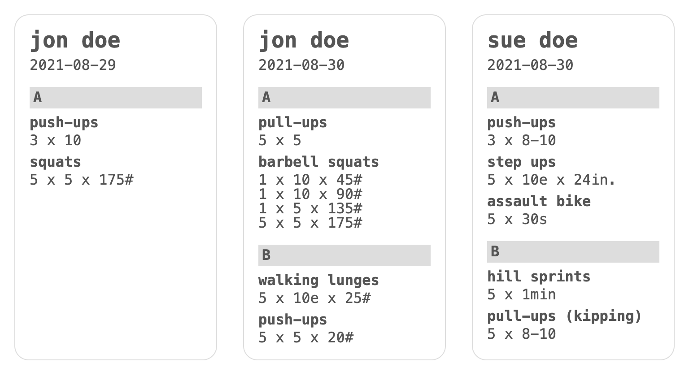

# wod-cli

A Node command-line utility to aggregate Markdown files into one HTML file.

## Install

```
$ npm install --global @dtjv/wod-cli
```

## Usage

```
$ wod --help

Usage: wod [options]

A Node CLI to aggregate markdown files into one HTML file.

Options:
  -d, --dir <path>       Path to client folders (default: cwd)
  -c, --client <folder>  Specify a client folder (default: all)
  -f, --files [file...]  List markdown files (default: all)
  -o, --out <file>       Write result to file (default: stdout)
  -h, --help             Display help for command

Notes:
  1. '--dir <path>' is relative to current working directory
  2. '--client <folder>' is relative to '--dir'

Examples:
  # Process all folders in 'clients' folder.
  $ wod -d clients

  # Process all files in a client folder. Redirect output to a file.
  $ wod -c jon-doe > jon.html

  # Process a file for a client.
  $ wod -c jon-doe -f 2021.01.01.md -o jon.html

  # Process specific files for all clients.
  $ wod -f 2021-01-01.md 2021-01-03.md
```

## Example

```bash
$ git clone https://github.com/dtjv/wod-cli.git
$ cd wod-cli/
$ yarn  # or `npm i`
$ yarn example > wod.html
```

The output...



## About

In my previous job as a personal trainer, I wrote workouts for each client
scheduled to train that day. The problem was printing 8-10 pages - one for each
client workout - **every** day. What I needed was a way to get all workouts for
a specific day onto one page.

To solve my problem, I wrote a bash script - and I used it for many years.
Around 2015, I implemented a solution in JavaScript. As I dove deeper into the
JavaScript and Node ecosystem, I built two more implementations using
[Streams](https://nodejs.org/dist/latest-v16.x/docs/api/stream.html),
[Pandoc](https://pandoc.org/), [Gulp](https://gulpjs.com/),
[Babel](https://babeljs.io/) and a host of other cool modules. The previous
implementations are located in [versions](versions) folder.

This repo holds my latest implementation. It is by far my simplest version with
no dependency on Pandoc. It uses [Commander](https://github.com/tj/commander.js)
for CLI options parsing and various plugins from the
[unified](https://github.com/unifiedjs/unified) collective.

## Author

- [David Valles](https://dtjv.io)

## License

[MIT License](LICENSE)
